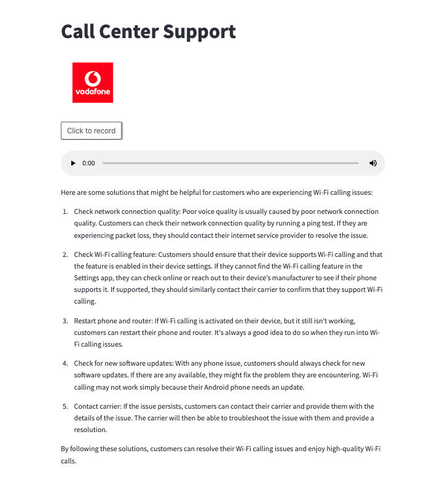

# Call Center Automation - Using Speech Recordings and Document Q/A search powered by Astra DB Agent

The demo showcases a use case in a  company that wants to process voice recordings or call automation where customer issues are resolved using a knowledge base or data that is coming from call center call analytics. 

Customers can interact with the system through voice messages, automated calls, or chatbots on the website. 




# Step 1: Creating Document Embeddings

* Table Creation: 
```
CREATE TABLE vector.callcenter (
    document_id text PRIMARY KEY,
    document text,
    embedding_vector vector<float, 1536>,
    metadata_blob text
);

CREATE CUSTOM INDEX callcenter_embedding_idx ON vector.callcenter (embedding_vector) USING 'org.apache.cassandra.index.sai.StorageAttachedIndex';

```

To enable efficient search and retrieval of relevant information, we create embeddings for documents that contain problem solutions or insights from past agent calls. These embeddings are stored as vectors in Astra DB, a distributed database built on Apache Cassandra.

```
 # loop through all files in the folder all X seconds
while True:
	for filename in os.listdir(config['config_inputdir']):
		# check if the file is a PDF
		if filename.endswith(".pdf"):
			# load the PDF file
			doc_path = os.path.join(config['config_inputdir'], filename)
			loader = PyPDFLoader(doc_path)
			pages = loader.load_and_split()
			logging.info(f"Processed PDF file: {filename}")
		# check if the file is a TXT 
		elif filename.endswith(".txt"):
			logging.info(f"Processed TXT file: {filename}")
			doc_path = os.path.join(config['config_inputdir'], filename)
			loader = TextLoader(doc_path)
			pages = loader.load_and_split()
			logging.info(f"Processed TXT file: {filename}")
		# other files will not be processed
		else:
				# handle the case where the file has an unsupported extension
				logging.info(f"Unsupported file type: {filename}")

		# if some file was loaded 
		if len(pages) > 0:
			# store in our vectordb
			embeddings = OpenAIEmbeddings(openai_api_key=api_key)
			vectordb = Cassandra.from_documents(documents=pages, 
				embedding=embeddings, 
				persist_directory=".",
				session=session,
				keyspace=ASTRA_DB_KEYSPACE,
				table_name=ASTRA_DB_TABLE_NAME,
			)
			
			# move processed files into another folder
			output_file = os.path.join(config['config_outputdir'], filename)
			os.rename(doc_path, output_file)

			# empty pages
			pages = ""
	logging.info(f"Run completed - {datetime.datetime.now()}")
	#time.sleep(5)
#this python code will now loop infinitely. 
```

# Step 2: Voice Recording via Website
Next, we need to capture some voice messages. This demo allows customers to record voice messages through a website using Streamlit's audio recorder functionality and OpenAI whisper to transcribe the recording. This enables you to use the content of the voice message as a text input for your prompt embedding.

```
import openai
import streamlit as st
from audiorecorder import audiorecorder
import streamlit as st

st.title('Vodafone- Call Center Support')
image = Image.open(global_client_branding_logo)
st.image(image)
audio = audiorecorder("Click to record", "Recording...")

if len(audio) > 0:
    st.audio(audio.tobytes())
    wav_file = open("test.mp3", "wb")
    wav_file.write(audio.tobytes())

    openai.api_key = global_openai_api_key
    audio_file = open(global_audio_file_path, "rb")
    user_question = openai.Audio.transcribe("whisper-1", audio_file)

```

# Step 3: Doing Vector Search using an Agent
The provided code defines a tool called AudioSearch that combines character recognition and vector search capabilities to help users find relevant information based on their questions. This tool utilizes Astra DB, a distributed database built on Apache Cassandra, to store and retrieve document embeddings.

When a user asks a question, the AudioSearch tool creates an embedding, which is a mathematical representation of the question. It then performs a vector similarity search in the Astra DB by comparing the question's embedding with the embeddings of documents stored in the database. The tool retrieves the document with the closest embedding to the user's question, indicating the most relevant solution or information.

This tool is particularly useful in scenarios like call centers, where quick and accurate information retrieval is crucial for resolving customer queries or issues. By leveraging the AudioSearch tool, call center agents can efficiently access relevant information, leading to improved customer satisfaction and reduced resolution times.

The AudioSearch tool is defined as a class that inherits from the BaseTool class. It has a _run method that takes a user_question as input. Inside the method, the tool creates an embedding for the user's question using OpenAI's text-embedding-ada-002 model. It then executes a query on the Astra DB to find the document with the closest embedding to the user's question. The retrieved document is returned as the result.

The agent is initialized using the initialize_agent function, which takes various parameters such as the agent name, the tools to be used (including the AudioSearch tool), the OpenAI language model, and memory settings. The agent is responsible for processing user questions and generating appropriate responses using the defined tools.

```
class AudioSearch(BaseTool):
    name = "AudioSearch"
    description = "Use this tool when you are asked information about invoice or need a summary of the solution."

    def _run(self, user_question):
        KEYSPACE_NAME = 'mykeyspace'
        TABLE_NAME = 'callcenter'
        model_id = "text-embedding-ada-002"
        embedding = openai.Embedding.create(input=user_question, model=model_id)['data'][0]['embedding']
        for row in session.execute(f"SELECT document_id, document, embedding_vector FROM {KEYSPACE_NAME}.{TABLE_NAME} ORDER BY embedding_vector ANN OF {embedding} LIMIT 1"):
            med_res = row.document 

        return med_res 

    def _arun(self, query: str):
        raise NotImplementedError("This tool does not support async")

##############################
### Initialize Agent #########
##############################
tools = [AudioSearch()]

## Agent definition
agent = initialize_agent(
    agent="chat-conversational-react-description",
    tools=tools,
    llm=llm,
    max_iterations=5,
    verbose=True,
    memory=conversational_memory,
    early_stopping_method='generate'
)

##############################
### Compute Agent Response ###
##############################
if user_question and user_question != "":
    with st.spinner(text="In progress..."):
        response = agent.run('{}, {}'.format(user_question, user_question))
        st.write(user_question)
        st.write(response)
```


 